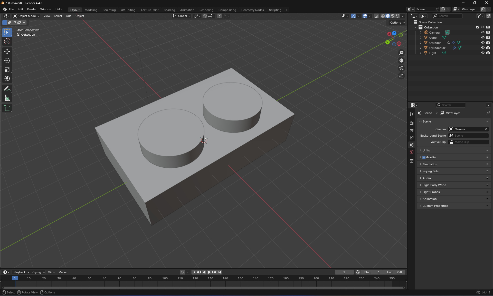

# 19/7/25: Brainstorming

Today I brainstormed about what features the box can have. Two knobs or one? Do I really need them separately or 
will one (with a toggle switch) do?

Well, I decided to go with two knobs, just in case I want to use the gimbal to perform more complex movement in the 
future.

One important thing about the knobs, I want them to have like a little spring like thingy that provides rotational
restoring force, so that the more you turn it left or right from its equilibrium position the more it wants to return.
Why? Because that allows for more precise control. More displacement from the equilibrium position = faster movement. 
And moving the knob by e.g. 15 degrees everytime is easier to do than rotating it at e.g. 120rpm consistently. 

I created a super rough 3d model. My first time properly using blender

**Total time spent: 2h**

# 20/7/25: Figured out the UX, time to code

Finally figured out the UX and the feature, which I consider to be one of the hardest things about any projects.
I've now got a clear idea about what exactly this project's going to have, except for making the potentiometers have 
like a little spring built in. I swear I've seen those on RC car remotes but can't find them anywhere else.

Got started with the code and laid out some starter code. I've got no hardware currently so everything's untested and 
will be until I've written all the code. So it pretty much works _in theory,_ but we all know how much 'in theory' stuff 
works when it comes to code lmao. 

I learnt a lot about cpp and the basics of arduino. It's gonna be a wild ride getting into a project like this with zero
experience from beforehand.

I've gotta start with the actual settings page and the webserver + Wi-Fi network for it hopefully tomorrow, and then 
the communication with the gimbal/app.

Total time spent: 2.5h
